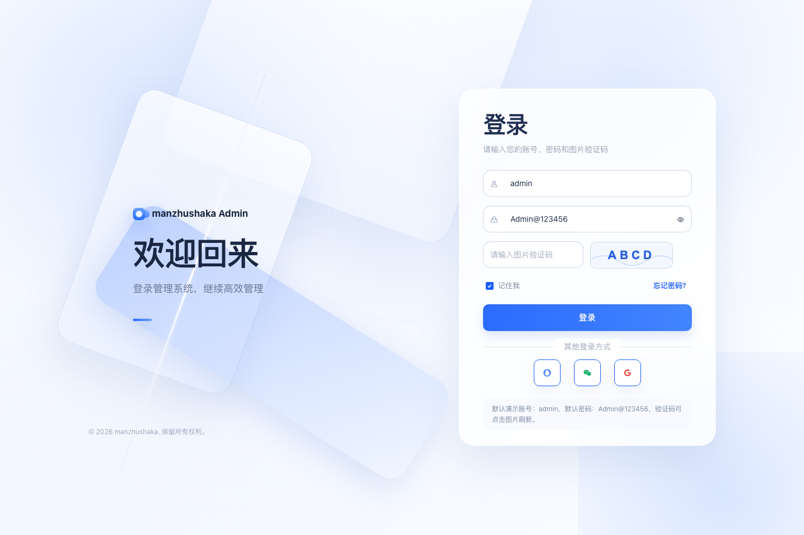
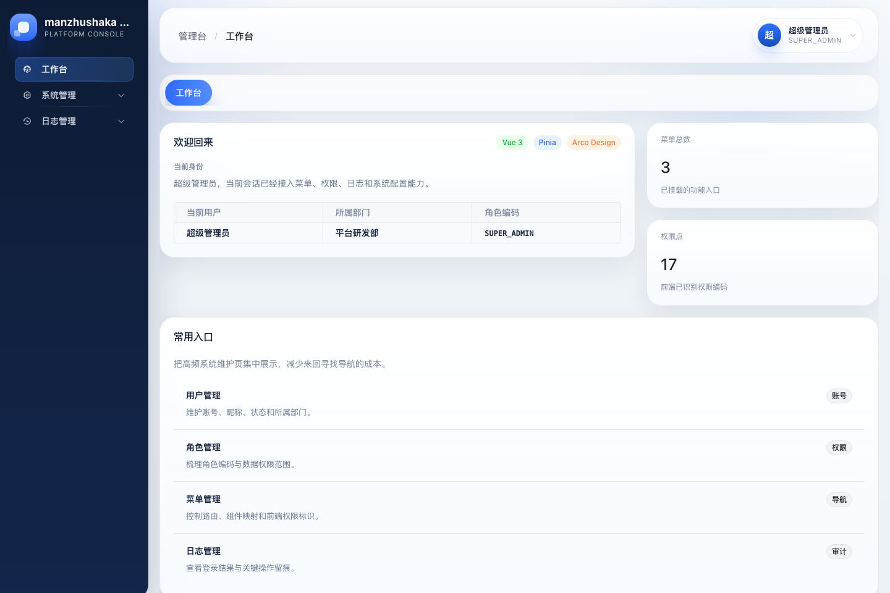
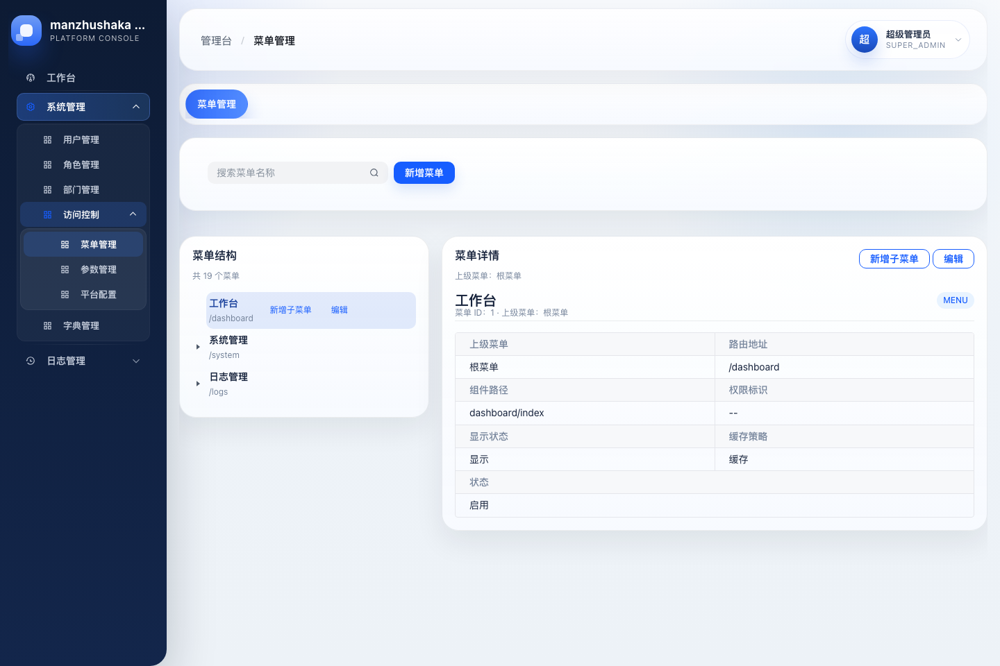

# manzhushaka-scaff

`manzhushaka-scaff` 是一个面向后台管理系统的一体化脚手架仓库，采用「后端 Maven 多模块单体 + 前端独立 `ui-admin`」的组织方式，当前聚焦第一版交付，覆盖认证、权限、系统管理、日志审计、导入导出、平台定时任务、任务执行日志、消息链路与消息台账等核心能力。

项目仍处于脚手架建设阶段。README 以当前仓库已经落地的模块、接口、页面和配置为准，方便后续继续扩展与二次开发。

同时，`manzhushaka-scaff` 也是一个用于 vibecoding 的实验性脚手架，主要想解决两个问题：

- 做 vibecoding 新项目时，经常需要重复搭建基础功能，或者重新做一轮项目代码开荒，前期成本高、上下文准备时间长。
- 希望尝试把开发规范和个人的一些使用习惯写进 `AGENTS.md`，在后续编码过程中约束 AI Agent 的工作边界、实现方式与协作习惯。

基于这两个目标，项目会预先搭好一批通用基础能力，并把适合当前仓库的约束沉淀到 `AGENTS.md` 中。当前项目主要通过 `Codex App` 进行开发。

## 项目特点

- 后端按领域与基础设施拆分为多个 Maven 模块，便于复用与边界控制。
- 前端采用 Vue 3 管理台方案，支持动态路由、按钮级权限控制和统一页面模式复用。
- 认证与权限基于 `Sa-Token`，支持当前用户信息、菜单装载、权限码下发。
- 审计日志采用 `AOP + Redis Stream` 异步链路，并配套消息台账、状态追踪与手动重试入口。
- 平台能力内置导入导出任务底座、Quartz 定时任务、任务执行日志和平台配置管理。

## 技术栈

### 后端

- `Java 17`
- `Maven 3.9+`
- `Spring Boot 3.3.2`
- `Sa-Token 1.39.0`
- `MyBatis-Plus 3.5.7`
- `MySQL 8.0`
- `Redis 7.0+`
- `Quartz`
- `Spring Validation`
- `Hutool Captcha`
- `Baidu BOS SDK`

### 前端

- `Vue 3.5`
- `Vite 5`
- `TypeScript 5.8`
- `Pinia`
- `Vue Router 4`
- `Axios`
- `Arco Design Vue`

## 仓库结构

```text
.
├── manzhushaka-auth/        认证模块：登录、验证码、当前用户、菜单与权限装载
├── manzhushaka-boot/        启动装配模块：Spring Boot 入口、application 配置
├── manzhushaka-common/      公共模型、枚举、注解、上下文、SPI 与工具类
├── manzhushaka-db/          数据库基础设施、实体与 Mapper
├── manzhushaka-framework/   Web、鉴权、数据权限、日志切面、Quartz、存储能力
├── manzhushaka-mq/          Redis Stream 消息发布与消费链路
├── manzhushaka-system/      系统管理领域：用户、角色、部门、菜单、字典等
├── sql/                     MySQL 初始化脚本
└── ui-admin/                Vue 3 管理台
```

## 后端模块说明

### `manzhushaka-boot`

启动模块，负责聚合其余业务模块并提供统一运行入口。

- 提供 Spring Boot 启动能力。
- 加载 `application.yml`、`application-dev.yml`、`application-prod.yml`。
- 默认后端端口为 `8080`。
- 当前已启用 Quartz 调度器，`job-store-type` 为 `memory`。

### `manzhushaka-common`

公共基础模块，承载各业务模块共享的基础定义。

- 通用响应模型 `ApiResponse`。
- 业务注解，如操作日志、数据权限等。
- 登录用户上下文、数据权限上下文。
- 公共枚举、异常与 SPI 扩展点。

### `manzhushaka-db`

数据访问基础模块，提供实体、Mapper 和持久层支撑。

- 集成 `MyBatis-Plus`。
- 对接 `MySQL` 数据源。
- 为系统管理、认证、日志、任务、消息台账等领域提供表结构映射。

### `manzhushaka-framework`

框架能力模块，负责横切逻辑和基础设施接入。

- `Sa-Token` 鉴权配置与登录态透传。
- 全局异常处理。
- `@DataScope` 数据权限切面与 SQL 条件拼装。
- `@OpLog` 操作日志切面。
- Quartz 任务调度封装。
- BOS 对象存储接入，供导入导出任务生成文件与下载链接。

### `manzhushaka-auth`

认证模块，负责登录流程及当前用户上下文装载。

当前已落地接口：

- `GET /api/auth/captcha`：获取验证码。
- `POST /api/auth/login`：账号密码登录。
- `POST /api/auth/logout`：登出。
- `GET /api/auth/me`、`GET /api/auth/profile`：获取当前用户信息。
- `GET /api/auth/menus`：获取当前用户菜单树。
- `GET /api/auth/permissions`：获取当前用户权限码。

### `manzhushaka-system`

系统管理领域模块，负责后台管理台的核心业务。

当前已落地接口分组：

- 用户管理：用户分页、详情、新增、编辑、删除。
- 角色管理：角色分页、详情、新增、编辑、删除、选项列表。
- 部门管理：部门树、详情、新增、编辑、删除、选项列表。
- 菜单管理：菜单列表、菜单树、路由装载、详情、新增、编辑、删除。
- 字典管理：字典类型分页、字典项查询、按字典编码查询、新增、编辑、删除。
- 参数管理：系统参数分页、详情、新增、编辑、删除。
- 日志管理：登录日志分页、操作日志分页。
- 消息台账：消息分页查询、状态查看、手动重试。
- 导入导出任务：任务分页、场景选项、生成下载链接；业务模块可基于模板方法扩展各自的导入导出任务提交入口。
- 平台任务：任务分页、详情、新增、编辑、删除、暂停、恢复、手动触发、执行日志查询。
- 平台配置：读取与保存平台配置。

### `manzhushaka-mq`

消息链路模块，当前已经具备 Redis Stream 通用台账能力，并落地在操作日志异步链路上。

- 通过统一发布器先写入 `sys_mq_message` 台账，再投递 `Redis Stream` 消息。
- 消费 `op log` 流并落库到 `sys_op_log`。
- 支持消息状态追踪、超时识别、失败重试与死信流转。

## 核心注解

当前平台已经落地或直接集成了以下几类核心注解：

| 注解 | 所属模块 | 作用 | 当前状态 |
| --- | --- | --- | --- |
| `@OpLog` | `manzhushaka-common` | 声明操作日志元数据，由 `OpLogAspect` 统一采集模块、动作、业务类型，并控制是否记录请求/响应快照 | 已用于认证登录、登出等接口 |
| `@DataScope` | `manzhushaka-common` | 声明数据权限规则，由 `DataScopeAspect` 按当前登录用户生成 SQL 数据范围片段 | 框架能力已就绪，可直接用于列表查询类业务 |
| `@SaIgnore` | `Sa-Token` | 标记匿名访问接口，跳过登录鉴权 | 已用于验证码等匿名入口 |

## 前端功能模块

前端管理台位于 `ui-admin/`，当前已落地页面与能力如下：

- 登录页：账号密码登录、验证码刷新。
- 仪表盘：`/dashboard` 首页入口。
- 用户管理：用户列表、新增、编辑、删除。
- 角色管理：角色列表、数据权限配置、菜单权限配置。
- 部门管理：部门树管理。
- 菜单管理：菜单树、路由字段与权限标识维护。
- 字典管理：字典类型与字典项维护。
- 参数管理：系统参数维护。
- 登录日志：登录记录查询。
- 操作日志：操作审计记录查询。
- 消息台账：Redis Stream 消息查询、状态查看、失败消息手动重试。
- 导入任务：查看业务模块提交的导入任务并下载源文件、结果文件。
- 导出任务：查看业务模块提交的导出任务并下载结果文件。
- 平台任务：定时任务维护、手动触发、查看执行日志。
- 平台配置：平台级配置维护。

前端当前具备的基础机制：

- 基于后端菜单数据动态生成路由。
- 基于权限码的按钮级显隐控制。
- 使用 `Pinia` 管理登录态、菜单和权限集合。
- 通过 Vite 代理将 `/api` 转发到 `http://127.0.0.1:8080`。

## 界面预览

以下截图基于本地 `VITE_USE_MOCK=true` 模式生成，用于展示当前脚手架的管理台风格与页面骨架。

### 登录页



### 工作台



### 菜单管理



## 业务功能总览

从交付视角看，当前脚手架已经覆盖以下核心功能模块：

| 功能模块 | 说明 |
| --- | --- |
| 认证中心 | 登录、登出、验证码、当前用户、菜单与权限装载 |
| 权限中心 | 角色权限、菜单权限、按钮权限、数据权限 |
| 组织中心 | 用户、角色、部门、菜单 |
| 配置中心 | 字典、系统参数、平台配置 |
| 审计中心 | 登录日志、操作日志 |
| 数据任务中心 | 导入任务、导出任务、文件下载 |
| 平台调度中心 | 定时任务配置、触发、暂停恢复、执行日志 |
| 消息台账中心 | 基于 Redis Stream 的消息投递、台账记录、状态追踪与手动重试 |

## 数据库初始化

初始化脚本位于 `sql/manzhushaka_init.sql`。

推荐先创建数据库：

```sql
CREATE DATABASE IF NOT EXISTS manzhushaka
  DEFAULT CHARACTER SET utf8mb4
  COLLATE utf8mb4_0900_ai_ci;
```

再执行初始化脚本：

```bash
mysql --default-character-set=utf8mb4 -uroot -p manzhushaka < sql/manzhushaka_init.sql
```

当前脚本会初始化以下核心表：

- `sys_user`
- `sys_role`
- `sys_user_role`
- `sys_dept`
- `sys_menu`
- `sys_role_menu`
- `sys_dict_type`
- `sys_dict_item`
- `sys_config`
- `sys_import_export_task`
- `sys_mq_message`
- `sys_job`
- `sys_job_log`
- `sys_login_log`
- `sys_op_log`

## 运行环境

- `JDK 17`
- `Maven 3.9+`
- `MySQL 8.0`
- `Redis 7.0+`
- `Node.js 20+`
- `pnpm 9+`

## 环境变量

### 基础环境变量

| 变量名 | 说明 | 默认值或示例 |
| --- | --- | --- |
| `ACTIVE` | 当前配置文件直接读取的运行环境 | `dev` |
| `SPRING_PROFILES_ACTIVE` | Spring Boot 标准运行环境变量，也可用于覆盖 profile | `dev` |
| `DB_URL` | MySQL 连接串 | `jdbc:mysql://127.0.0.1:3306/manzhushaka?useUnicode=true&characterEncoding=utf8&serverTimezone=Asia/Shanghai` |
| `DB_USERNAME` | MySQL 用户名 | `root` |
| `DB_PASSWORD` | MySQL 密码 | `root` |
| `REDIS_HOST` | Redis 地址 | `127.0.0.1` |
| `REDIS_PORT` | Redis 端口 | `6379` |

### 导入导出相关可选变量

| 变量名 | 说明 |
| --- | --- |
| `BOS_ENDPOINT` | 百度 BOS 接入地址 |
| `BOS_BUCKET` | BOS Bucket 名称 |
| `BOS_ACCESS_KEY_ID` | BOS Access Key |
| `BOS_SECRET_ACCESS_KEY` | BOS Secret Key |
| `BOS_BASE_PATH` | 导入导出文件基础路径 |
| `BOS_DOWNLOAD_EXPIRE_SECONDS` | 下载链接有效期，默认 `900` 秒 |

## 快速开始

### 1. 启动后端

```bash
mvn clean package
```

```bash
export ACTIVE=dev
export DB_URL='jdbc:mysql://127.0.0.1:3306/manzhushaka?useUnicode=true&characterEncoding=utf8&serverTimezone=Asia/Shanghai'
export DB_USERNAME=root
export DB_PASSWORD=root
export REDIS_HOST=127.0.0.1
export REDIS_PORT=6379
mvn -pl manzhushaka-boot spring-boot:run
```

后端默认访问地址：

- `http://127.0.0.1:8080`

### 2. 启动前端

```bash
cd ui-admin
pnpm install
pnpm dev
```

前端默认访问地址：

- `http://127.0.0.1:5173`

前端构建命令：

```bash
cd ui-admin
pnpm build
```

## 常用校验命令

### 后端

```bash
mvn clean package
mvn -pl manzhushaka-auth test
mvn -pl manzhushaka-framework test
```

### 前端

```bash
cd ui-admin
pnpm build
pnpm test:unit
pnpm check:sidebar
pnpm check:mock-menus
```

## 默认初始化账号

初始化 SQL 当前会写入一个管理员账号：

- 用户名：`admin`
- 密码：`Admin@123456`

该默认密码仅适用于本地初始化和联调演示，正式环境应改为安全哈希存储，并在首次登录后尽快重置。

## 当前阶段说明

- 当前仓库已经具备一版管理台所需的核心骨架与主要系统管理能力。
- 定时任务当前使用内存型 Quartz 存储，适合本地开发和脚手架阶段验证。
- 消息台账当前已经提供查询与手动重试入口，默认接入的是操作日志异步链路。
- 导入导出依赖 BOS 配置；如未配置对象存储，仅相关任务能力会受限。
- 新增需求时，建议先复用已有模块边界、页面模式和权限控制方式，再做局部扩展。
